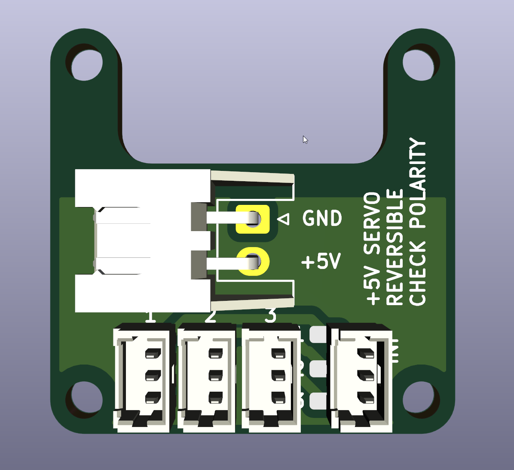
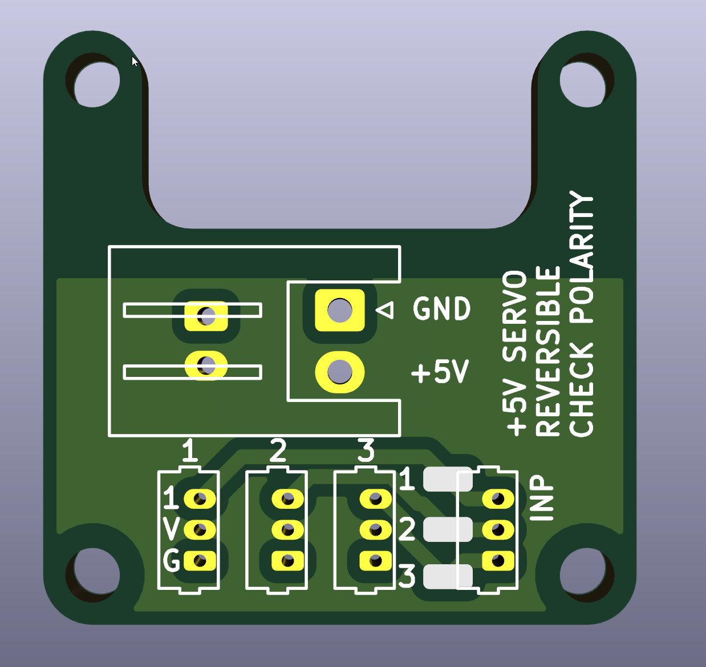

# Helicopter servo bus board
This project is a PCB designed to facilitate wiring a helicopter servo bus to a drone flight controller.

Mounting pattern: 20x20mm

The flight controller in mind when designing this PCB was a [GHF13AIO](https://www.aliexpress.com/af/ghf13aio.html).
This bus supports 3 servo outputs and so must be used for helicopters with a motor-driven tail connected to an ESC.

The connector footprints are for 1.25mm pitch connectors, such as Molex PicoBlade or JST 1.25.

**Please read the [assembly instructions](#assembly-instructions) before ordering or use**

## Instructions for ordering

First: Read the [assembly instructions](#assembly-instructions) and determine that this board is suitable for your setup.

You can order this PCB with a prototyping service.
Below are instructions for using [JLCPCB](https://jlcpcb.com):

1. Visit https://jlcpcb.com/.
2. Click "Order now' from the menu - do not use the quoting box.
3. Upload the file [gerber.zip](gerber.zip).
4. You may use the default options, but I suggest selecting a thickness of 0.8mm or 1.0mm. I also prefer the black PCBs.
5. Add to basket and check out. Take care to review the shipping options. FedEx is good if you would like this sooner, but there is usually a very cheap option depending on your location.

## Assembly instructions

To assemble you will need:

1. PicoBlade or JST 1.25 connectors to match your servo plugs.
2. JST-XH 2-way horizontal connector `S2B-XH-A(LF)(SN)`  
or  
JST-XH vertical or other 2.54mm connector.  
or  
JST-PH or other 2.00mm connector.

**Pay very close attention to plug wiring, pins and polarities!!!**

There are no standard servo plug pinouts.
Test everything with a multimeter before soldering, and again before powering on.

1. Make sure that your intended servos have the control wire as pin 1 or 3.
2. Solder your servo input connector, or use the solder pads directly. These are the control lines from your PWM servo outputs on your FC. If using solder pads you can solder directly to the wire pads, connector pads, or both. Use silicone glue to secure the wire.
3. Solder your servo connectors so that the control wire is the topmost pin, the row labelled "1".
4. Check the position of your servo positive and negative wires. They should line up with "V" (positive) and "G" (negative). If they do not (e.g. Blade servos) then you will need to install the power connector backwards.
5. Check the pins of your power connector and verify correct pins with a multimeter, then solder.
6. Test all connections a final time.